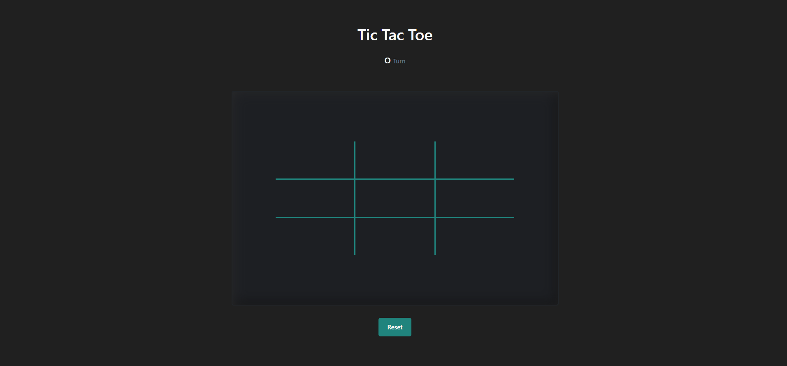
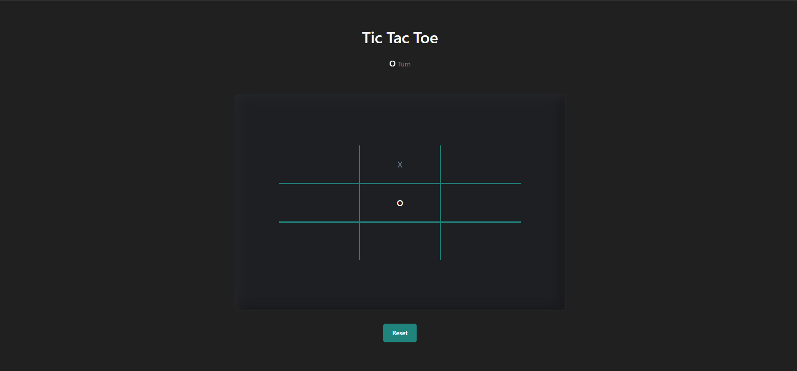
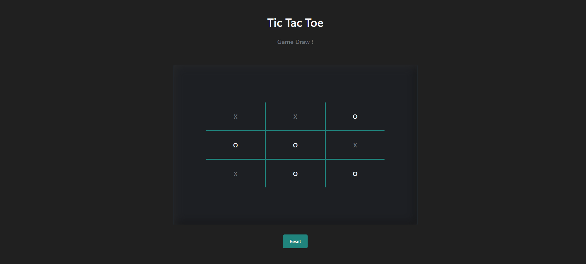
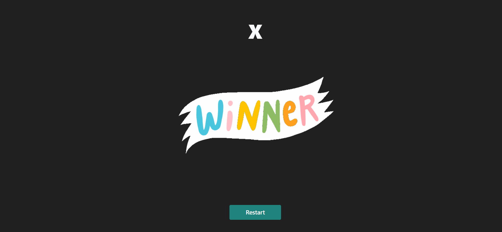
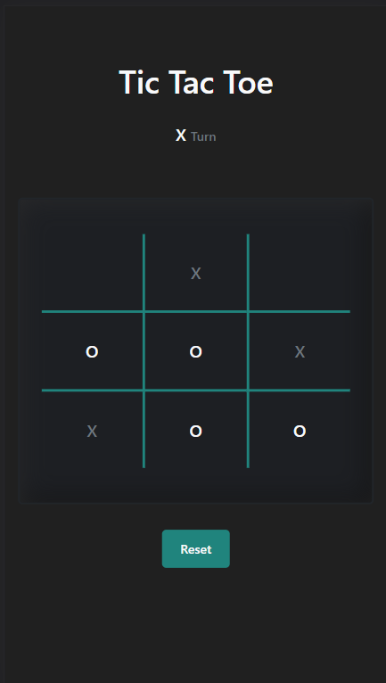
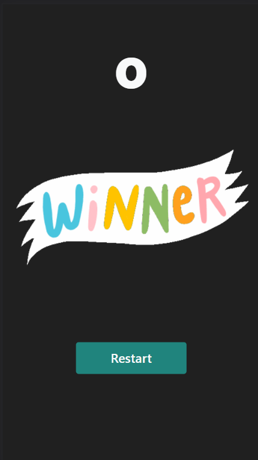

# Tic Tac Toe Game

> it very famous game any one can easily play and even easily develop 
it's really time pass game during school time and even any time with your `friends` and `girlfriend` 
any one can play and even easily understand the game
I also developed this game  just for fun and play it with my friends and i am waiting for playing with my `girlfriend`

### [Check Release](https://raj-rathod.github.io/tic-toc-game/)

### Desktop view 

 

### Desktop game start view
when the start game

 

 

### Desktop game draw view
when the game is drawn

 

### Desktop game winner view
its time to celebrate

 

### Mobile view
it is fully responsive for all platforms and mobile devices

 

### Mobile winner view
its time to celebrate

 

## Connect with me ~Rajesh Rathore

***Do star, fork and share the repo to show your support, it would help others too!***    
  
 Let me know your views or any changes or improvements or contribute to make better for others 
 
 :heart: ***Thank you all for Forking this repository and contribute***  :heart:
